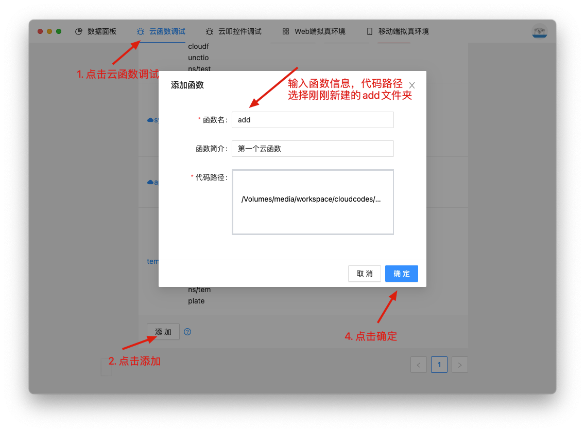
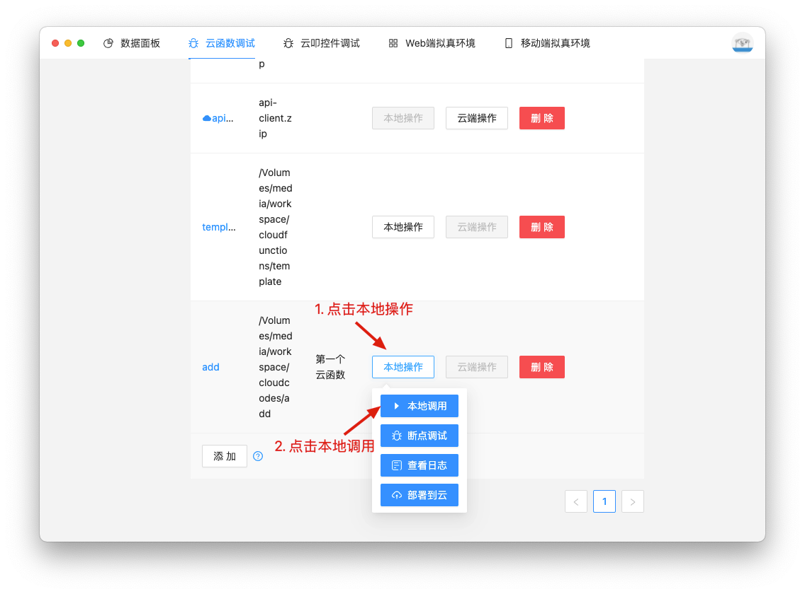
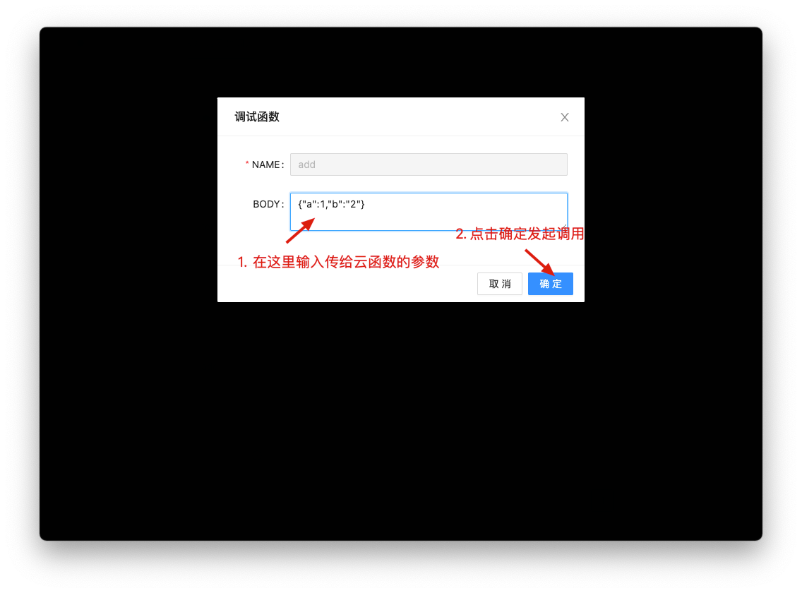
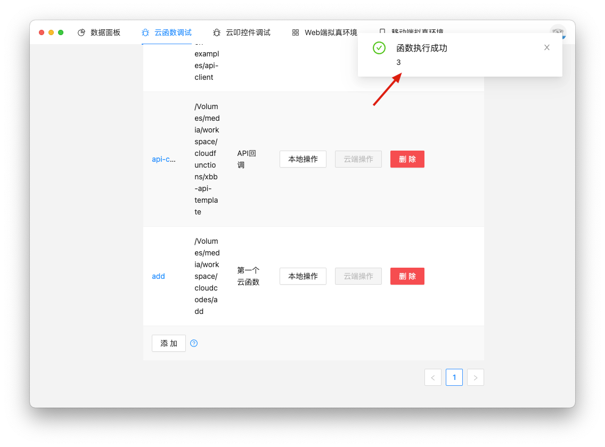
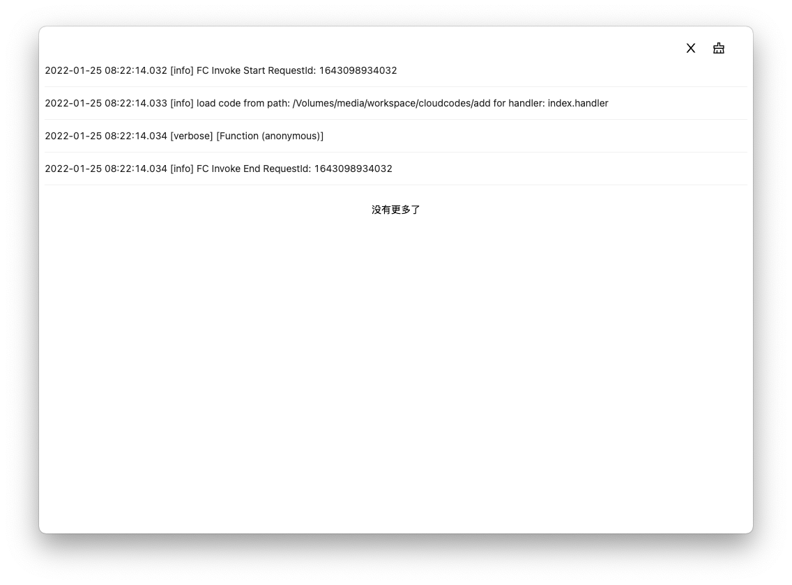

# 第一个云函数

1. 在cloudfunctions目录下新建一个云函数目录，名为`add`
3. 在`add`目录下使用`npm init -y `初始化npm
4. 在`add`目录下新建一个js文件，名为`index.js`
5. 在`index.js`文件中编写如下内容
```javascript
'use strict';

exports.handler = (event, context, callback) => {
  event = JSON.parse(event.toString()); // event用于接收事件参数，类型是个Buffer
  const {a, b} = event;
  callback(null, a + b); // 通过callback将结果返回，第一个参数是Error，第二个参数是返回的结果
}
```

## 参数说明
- event参数    
用于传递参数。其是一个Buffer，可以将其转成JSON后使用。
```javascript
JSON.parse(event.toString());
{
    args: {...},  // 用户传入的参数
    userInfo: {...}  // 函数调用者的用户信息
}
```
- context参数    
context参数主要包含一些函数的运行信息。
```javascript
{
    requestId: '...', // 本次调用请求的唯一ID，您可以把它记录下来在出现问题的时候方便查询
    function: {...}, // 当前调用的函数的一些基本信息，例如函数名、函数入口、函数内存和超时时间。
}
```
- callback函数    
callback是由系统定义的函数，作为入口函数的入参用于返回调用函数的结果，标识函数执行结束。其签名是function(err, data)，与Node.js中使用的callback一样，它的第一个参数是error，第二个参数data。

    * 如果调用时error不为空，则函数返回HandledInvocationError，否则返回data的内容。

    * 如果data是Buffer类型，则它的数据将直接被返回。
    * 如果data是object，则会将其转换成JSON字符串返回。
    * 如果data是其他类型将被转换成字符串返回。

## 使用云函数
### 使用开发者工具在本地调试云函数
使用[开发者工具](/devtool/)可以轻松对本地云函数进行调试。




这就能看到函数的执行结果了。你还可以使用查看日志功能查看函数执行的日志。如图所示

### 部署到云函数
当本地调试完成后就可以部署到云函数上使用了，首先将云函数压缩(需要包含`node_modules`目录)成zip压缩包，在云叩平台上传即可。


部署完成之后就可在[云叩插件](/plugin/api_list.html#%E8%B0%83%E7%94%A8%E4%BA%91%E5%87%BD%E6%95%B0)和[低代码](/lowcode/api_list.html#%E8%B0%83%E7%94%A8%E4%BA%91%E5%87%BD%E6%95%B0)中调用了。
