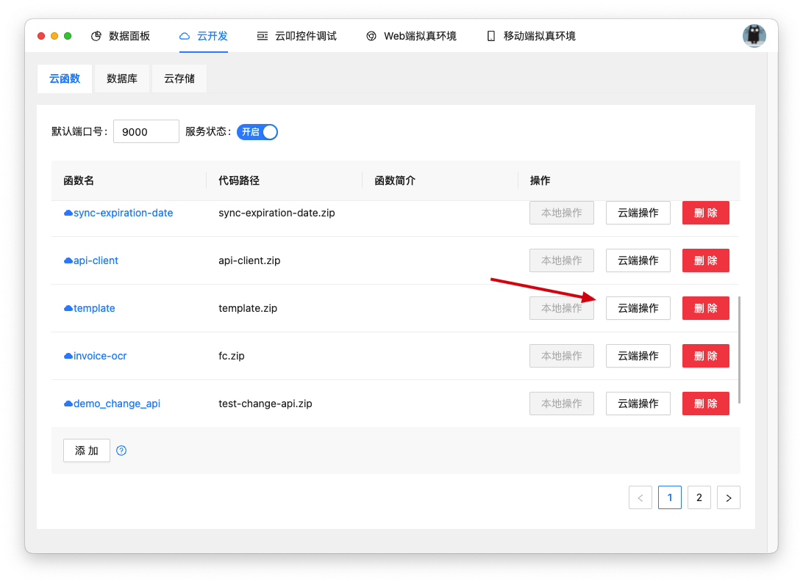
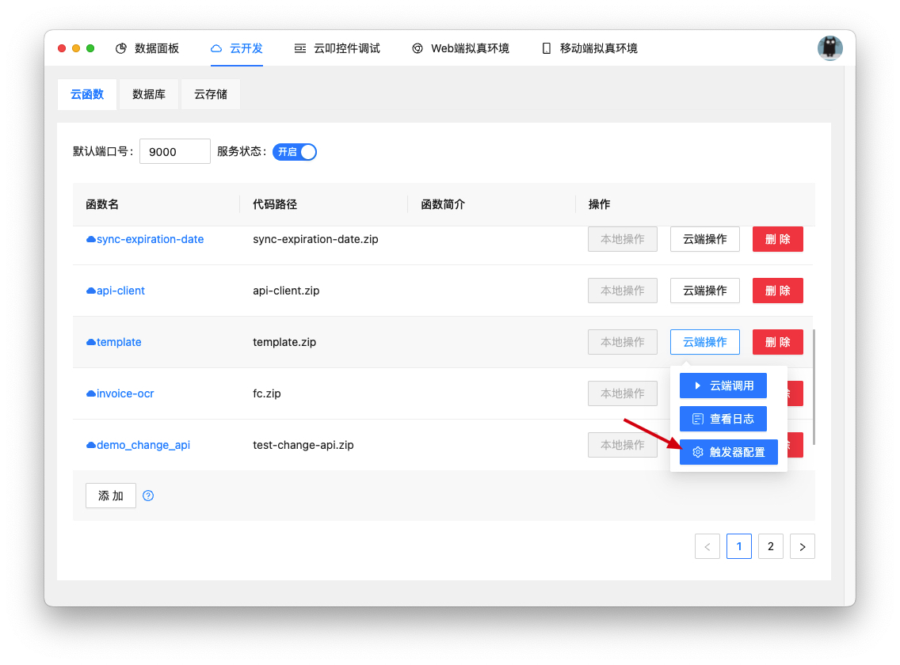
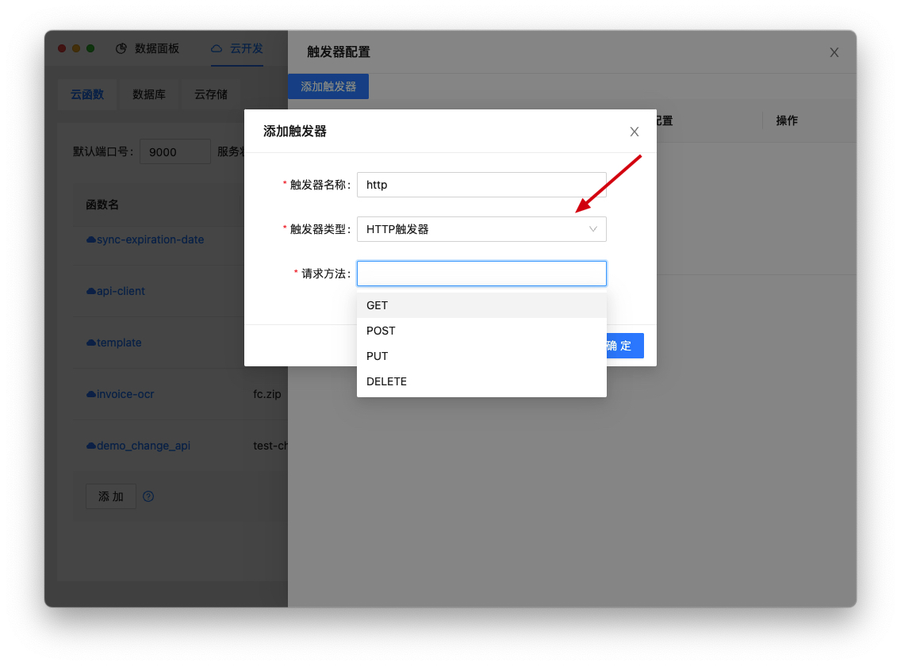
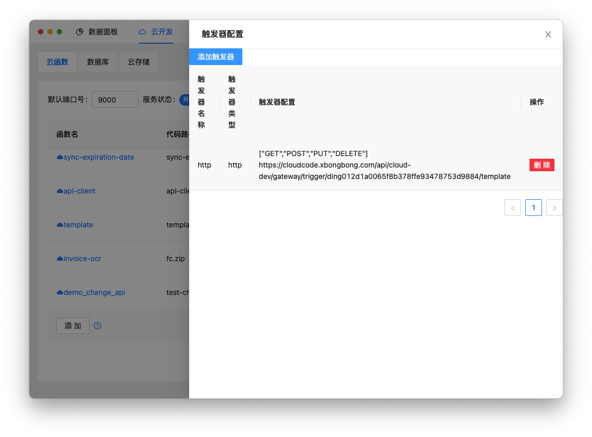

# 触发器

> 触发器是触发函数执行的方式，目前云叩支持HTTP触发器和定时触发器两种类型。

## HTTP触发器
> HTTP触发器通过发送HTTP请求触发函数执行，主要适用于构建Web服务、API WebHook等场景。
1. 创建HTTP触发器
在云叩开发者工具中选中要操作的函数，云端操作-触发器配置-添加触发器-触发器类型选择HTTP触发器-请求方法选择自己需要的即可。目前仅支持`GET`、`POST`、`PUT`、`DELETE`四种请求方式。
2. 创建完成之后界面会有个`url`，用对应的方法去请求`url`即可。

## 定时触发器
> 定时触发器会在指定时间自动触发函数执行。一般用于定时处理数据或者定时发送通知等场景。
1. 创建定时触发器
在云叩开发者工具中选中要操作的函数，云端操作-触发器配置-添加触发器-触发器类型选择定时触发器-填写定时任务的Cron表达式即可。

2. Cron表达式默认以UTC时间运行，即北京时间减去8个小时。例如北京时间每天12:00触发函数，那么转化为UTC时间就是每天4:00触发函数，则可以使用`0 0 4 * * *`。

3. 关于Cron表达式：      
   Cron适用于周期性执行、日常维护、在某时刻需要完成的单次任务等场景。Cron表达式是一个具有时间含义的字符串，字符串以5个空格隔开，分为6个域，格式为X X X X X X。其中X是一个域的占位符。单个域有多个取值时，使用半角逗号,隔开取值。每个域可以是确定的取值，也可以是具有逻辑意义的特殊字符。

域取值
下表为Cron表达式中六个域能够取的值以及支持的特殊字符。

| 域   | 是否必需 | 取值范围                                               | 	特殊字符                                                      |
|-----|------|----------------------------------------------------|------------------------------------------------------------|
| 秒   | 是    | [0, 59]                                            | 不支持                                                        |
| 分钟  | 是    | [0, 59]                                            | 对, 和/有限支持（如果使用逗号，数字之间的间隔必须大于等于30分钟；如果使用/ ，/后面的数字必须大于等于30）。 |
| 小时  | 是    | [0, 23]                                            | 	* , - /                                                   |
| 日期  | 是    | [1, 31]                                            | 	* , - / ? L                                               |
| 月份  | 是    | [1, 12]或[JAN, DEC]                                 | * , - /                                                    |
| 星期  | 是    | [1, 7]或[SUN, SAT]若您使用[1, 7]表达方式，`1`代表星期天，`2`代表星期一。 | 	* , ?                                                     |

特殊字符
Cron表达式中的每个域都支持一定数量的特殊字符，每个特殊字符有其特殊含义。

| 特殊字符 | 含义                                                                | 示例                                                |
|------|-------------------------------------------------------------------|---------------------------------------------------|
| `*`  | 	所有可能的值。                                                          | 在月域中，`*`表示每个月；在星期域中，`*`表示星期的每一天。                  |
| `,`  | 列出枚举值。                                                            | 在分钟域中，`5,40`表示分别在5分钟和40分钟触发一次。                    |
| `-`  | 范围。                                                               | 在日期域中，`5-20`表示从5号到20号之间每天触发一次。                    |
| `/`  | 指定数值的增量。                                                          | 在日期域中，`1/5`表示从第1号开始，每5天。在小时域中`3/8`表示从第3小时开始，每8小时。 |
| `?`  | 不指定值，仅日期和星期域支持该字符。                                                | 当日期或星期域其中之一被指定了值以后，为了避免冲突，需要将另一个域的值设为`?`。         |
| `L`  | 单词Last的首字母，表示最后一天，当前仅在日期域支持该字符。说明 指定`L`字符时，避免指定列表或者范围，否则，会导致逻辑问题。 | 在日期域中，`L`表示某个月的最后一天。                              |

4. 您也可以通过一些[在线生成器](https://cron.qqe2.com/)自动生成Cron表达式。但是要注意时区问题要减去八小时。