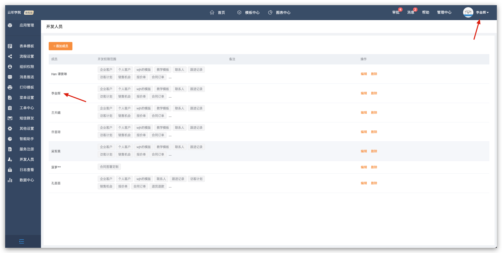
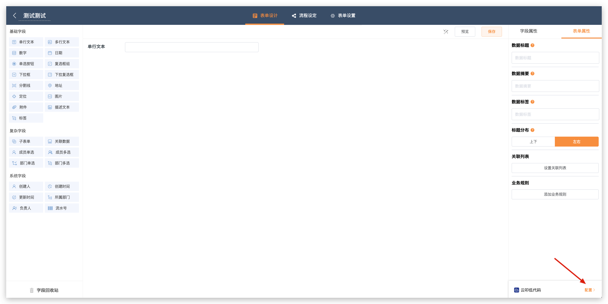
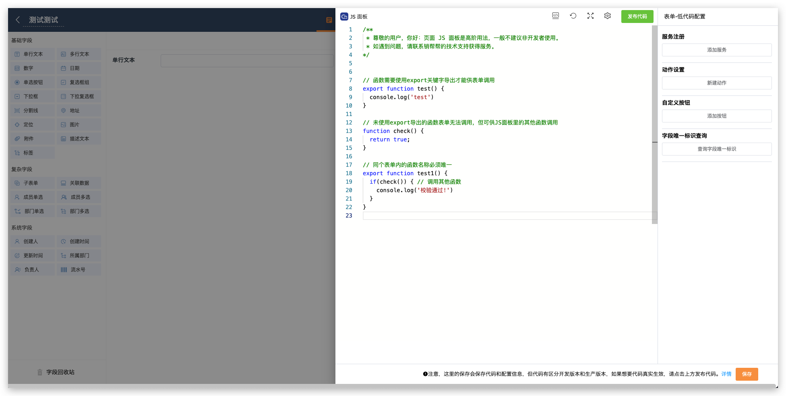
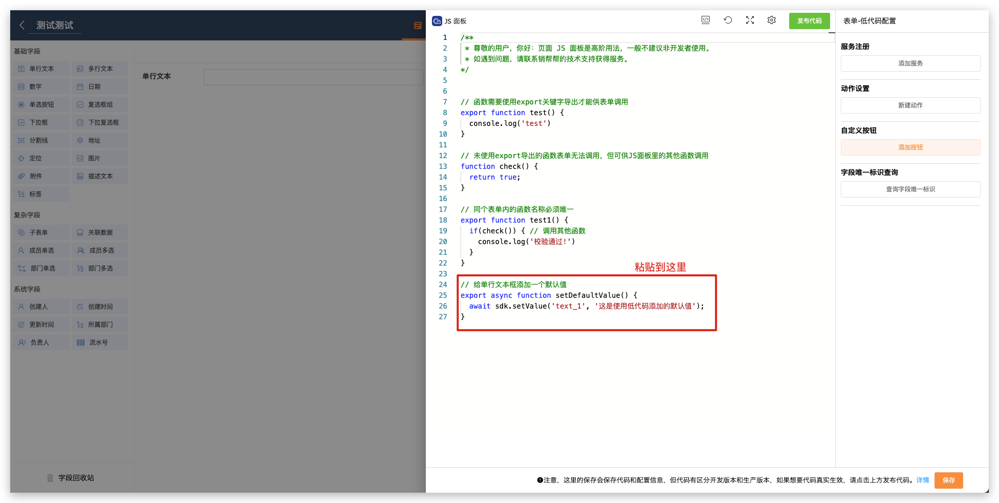
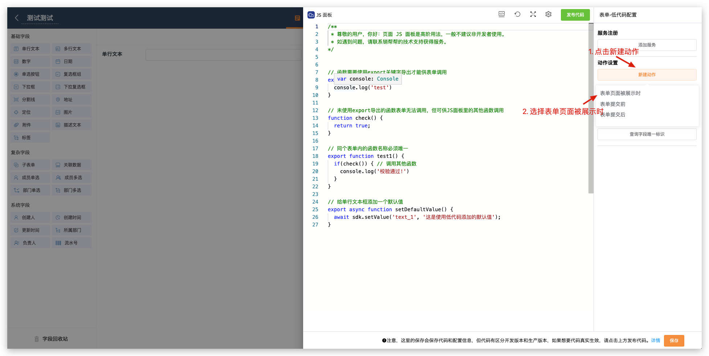
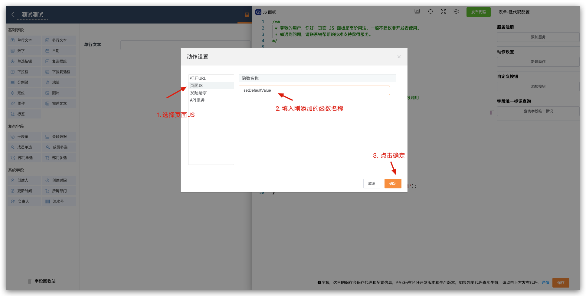
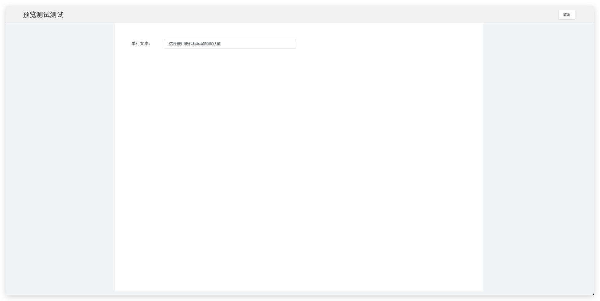

# 快速上手

> 在正式开始之前，我们强烈建议你先阅读   
> - [JavaScript教程](https://developer.mozilla.org/zh-CN/docs/Web/JavaScript)
> - [Promise](https://developer.mozilla.org/zh-CN/docs/Web/JavaScript/Reference/Global_Objects/Promise)
> - [Async_await](https://developer.mozilla.org/zh-CN/docs/Learn/JavaScript/Asynchronous/Async_await)
> 
> 等初步具备JavsScript编码能力之后再进行低代码开发，否则可能会造成**系统异常**甚至导致**数据错乱**等<span style="color:red;font-weight: bold">不可逆</span>的后果。

在开始使用低代码之前需要给开发者添加对应表单的开发者权限

添加完成之后我们就可以去对应的表单设计页开发低代码了

在页面的右下角点击`低代码配置`，打开低代码编辑弹窗。

编辑弹窗的左边是代码编辑区域，可以在这里编辑你的代码。系统会默认生成一个代码模板，你可以在这里修改你的代码。右边是低代码的配置部分和一些编写代码的辅助工具。
下面编写一个低代码用于给单行文本框添加一个默认值。
你可以将下面的代码粘贴到你的代码编辑器里
```javascript
// 给单行文本框添加一个默认值
export async function setDefaultValue() {
  await sdk.setValue('text_1', '这是使用低代码添加的默认值');
}
```

编辑完成之后，点击编辑器上方的`发布`按钮，发布你的代码。

代码编写完成后需要制定在什么时候触发代码，这里我们使用在`表单被展示时`触发。



动作添加完成后，点击下方的`保存`按钮，保存动作的配置。


然后进入预览就可以看到低代码的效果了。
