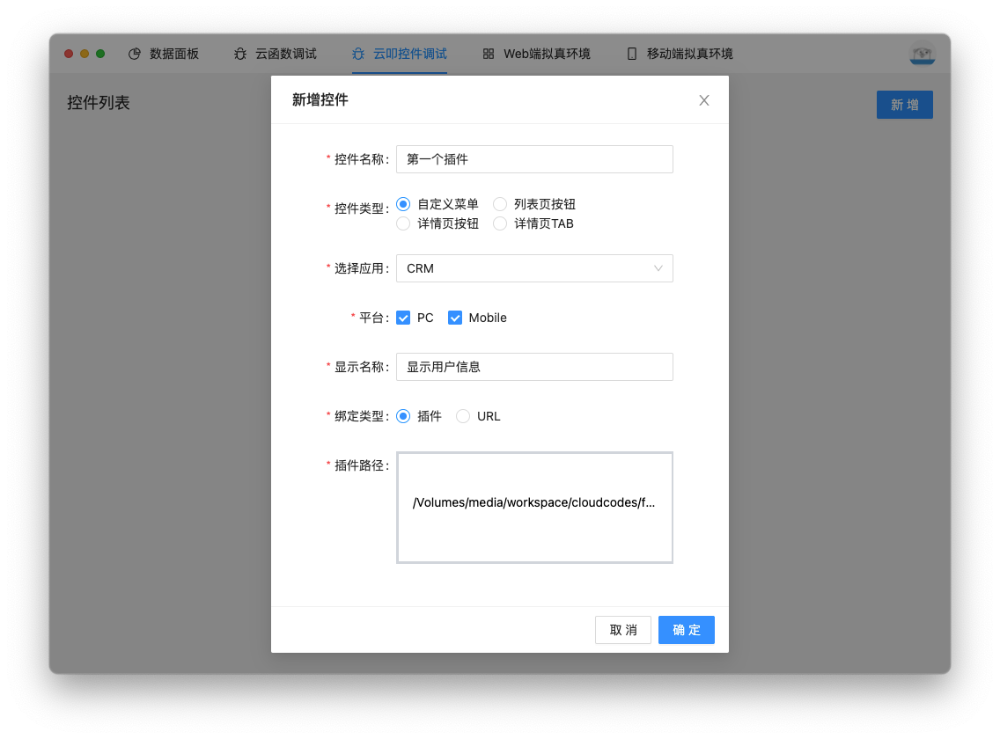
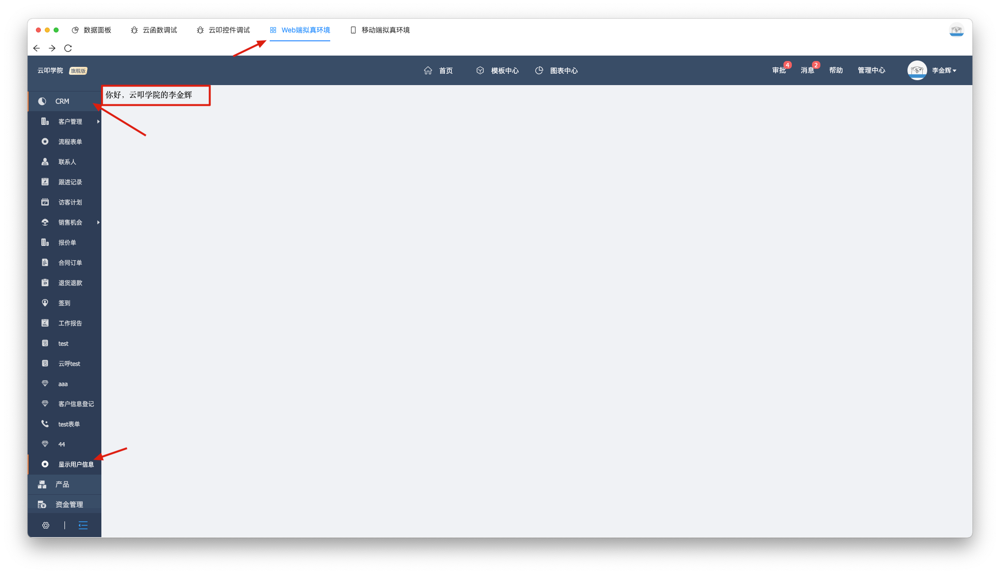
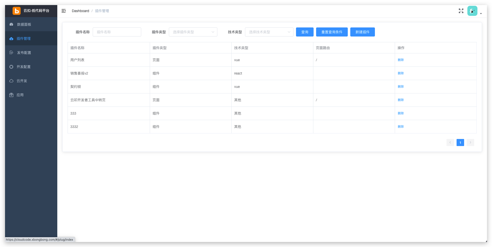
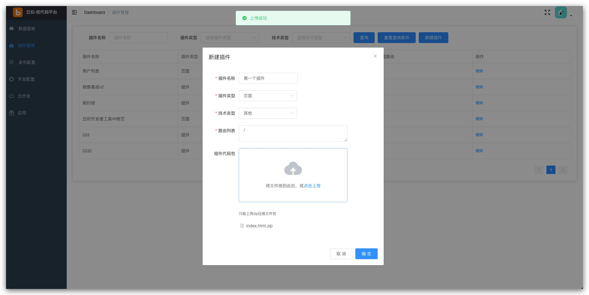
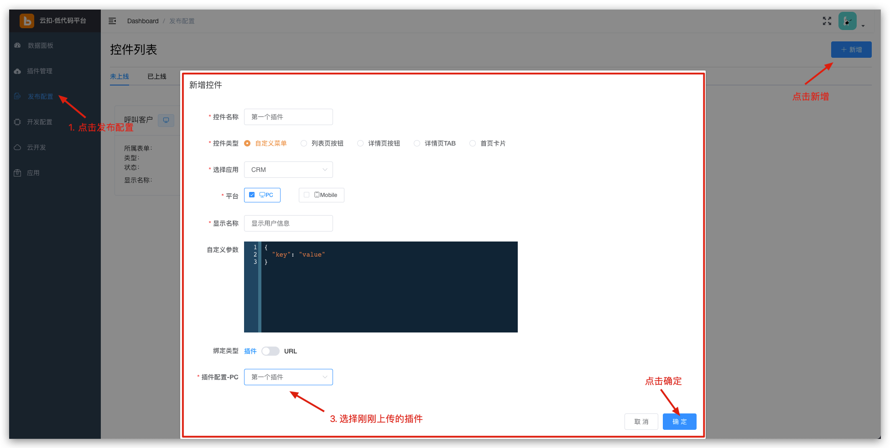
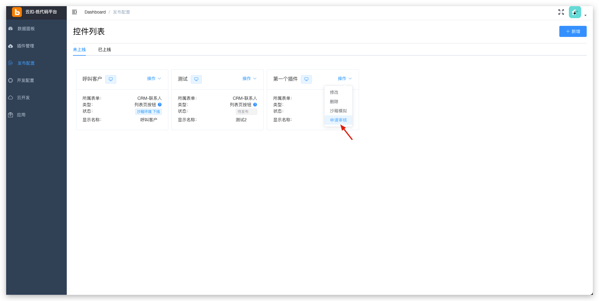
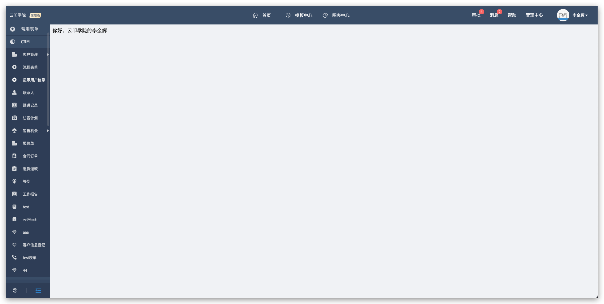

# 开始

## 申请账号

在一切开始之前，你需要先去开通[销帮帮CRM](https://appwebfront.xbongbong.com/)，开通完成之后在套餐信息里面拿到公司的`corpid`


然后去[云叩平台](http://cloudcode.xbongbong.com/)上注册账号。之后登录进入系统。


## 安装开发者工具(推荐但非必须)

开发者工具提供了移动端模拟器和调试本地插件等功能，可[点此下载](/cloudcode-doc/devtool/)下载安装。


## 你的第一个插件

首先，一个插件就是一个网页，所以你可以用任何你喜欢的Web技术栈去开发。包括但不限于`Vue`、`React`和`Angular`等现代化的前端框架。
这里用最简单的`HTML + CSS + JavaScript`来演示一个插件的开发。

首先在你的工作目录下新建一个名为`first-plugin`的文件夹，随后用编辑器打开，这里采用[vscode](https://code.visualstudio.com/)

新建一个名为`index.html`的`HTML`文件，下面代码粘贴进去，然后保存。这样就完成了一个插件的开发。
```html
<!DOCTYPE html>
<html lang="en">

<head>
    <meta charset="UTF-8">
    <meta http-equiv="X-UA-Compatible" content="IE=edge">
    <meta name="viewport" content="width=device-width, initial-scale=1.0">
    <title>第一个云叩插件</title>
    <!-- 引入云叩SDK -->
    <script src="https://cdn.jsdelivr.net/npm/xbb-sdk/index.js"></script>
</head>

<body>
<div>
    你好，<span class="corpname"></span>的<span class="username"></span>
</div>
<script>
    // 在SDK加载完成后调用
    xbb.ready(() => {
        // 使用云叩SDK获取当前登录的用户信息
        xbb.getUserInfo().then(userInfo => {
            // 将公司名称显示在当前页面上
            document.querySelector('.corpname').innerHTML = userInfo.companyName;
            // 将用户名称显示在当前页面上
            document.querySelector('.username').innerHTML = userInfo.userName;
        }).catch(err => {
            console.log(err)
        })
    })
</script>
</body>

</html>
```

如图所示


然后打开开发者工具，切换到`云叩控件调试`页面，点击`新建`按钮，输入对应的信息，如图所示：

然后点击确定保存，然后切到Web端拟真环境，查看插件是否正常。



可以看到已经能正常显示了。但是注意，这里只会在开发者工具里显示，在正式环境中不会显示。如果要在正式环境上使用，需要发布插件。

## 发布插件

确定插件没有问题之后，就可以去云叩平台上进行发布了。

首先是上传插件，点击`插件管理`->`新增`进行上传



输入插件信息，并将`index.html`文件压缩成`zip`包进行上传

然后点击确定插件就上传好了。

插件上传好后还需要关联对应控件，控件用来控制插件显示的时机和位置。目前云叩平台支持在销帮帮CRM的`菜单栏`、`列表页`、`详情页`增加对应的控件。

添加完成之后需要申请审核

等审核完成就可以进行发布了

可以看到插件已经可以正常显示了


